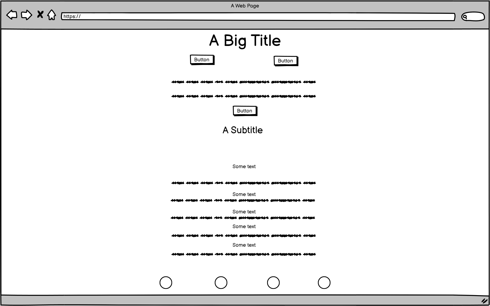
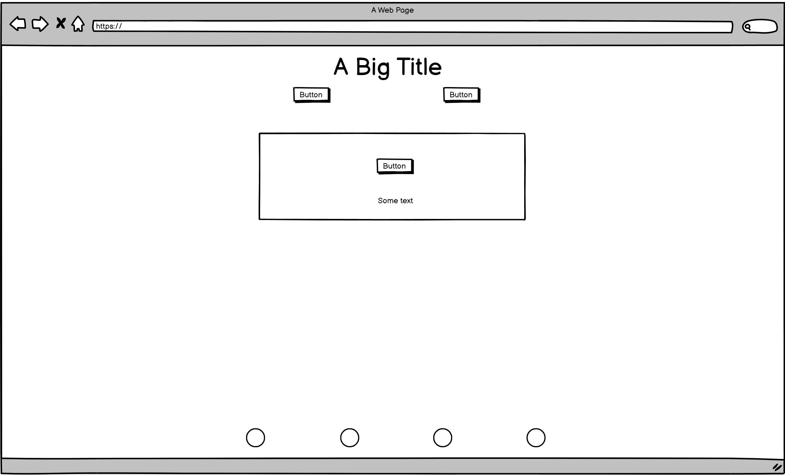
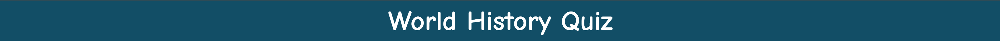
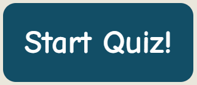
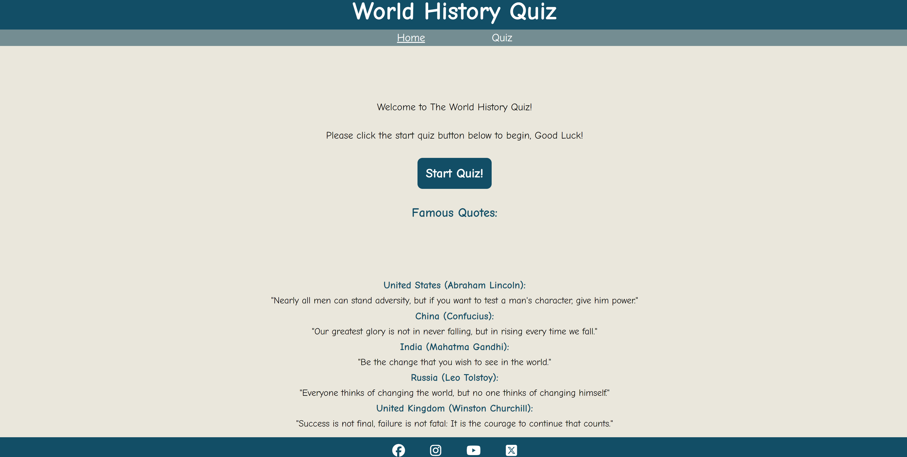
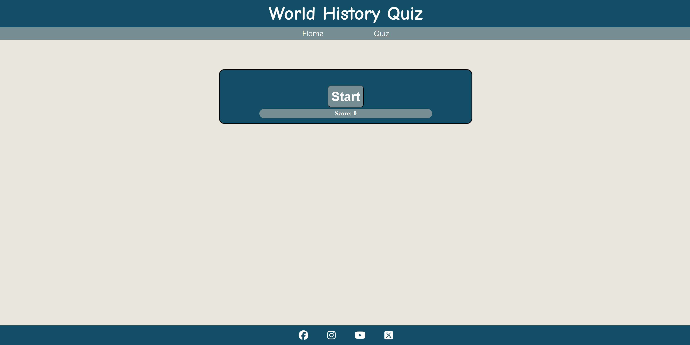

# World History Quiz

Visit the deployed site: [World History Quiz](https://ashley9368.github.io/History-Quiz/)

Test your world history knowledge, See how well you can do.

I've always had a passion for world history, so I decided to create a world history quiz. 
It's a fun and interactive way to learn about the past and test your knowledge. 
Plus, I’m sure there are many others out there who share this love for history and would enjoy a quiz like this too.

## CONTENTS

* [User Experience](#user-experience-ux)

* [Design](#design)
  * [Colour Scheme](#colour-scheme)
  * [Wireframes](#wireframes)
  * [Features](#features)
    * [The Home Page](#the-home-page)
    * [Future Implementations](#future-implementations)
  * [Accessibility](#accessibility)

  * [Languages Used](#languages-used)
  * [Frameworks, Libraries & Programs Used](#frameworks-libraries--programs-used)

* [Deployment & Local Development](#deployment--local-development)
  * [Deployment](#deployment)

* [Testing](#testing)
  * [Known Bugs](#known-bugs)
  
* [Credits](#credits)
  * [Code Used](#code-used)
  * [Content](#content)
  * [Media](#media)
  * [Acknowledgments](#acknowledgments)

## User Experience (UX)

#### First Time Visitor Goals

* I want to dive into an engaging history quiz website and expand my knowledge about world history in a fun way.
* I want the site to work smoothly on my device, whether I'm using a phone, tablet, or computer.
* I want the site to be easy to navigate, so I can find the information and quizzes quickly and effortlessly.

#### Returning Visitor Goals

* I want to keep returning to discover fresh questions and intriguing historical challenges that expand my knowledge of different eras and figures. I’m excited to see what new topics will be featured and to continually test my understanding of world history.

#### Frequent Visitor Goals

* I want to come back often to explore new questions and learn more about different historical topics. I’m excited to keep improving my history knowledge with each visit.

## Design

### Colour Scheme

I have gone with the blue and light beige theme to give a nice clean look and feel to my website.

* I have used `#124E66` `#EAE7DC` & `#748D92`as the primary colours and white as the text colour `#ffffff` 
* I also used `Green` and `Red` for correct and incorrect colours for the answers

### Wireframes

I created Wireframes using balsamiq

### Features

The website is made of a Home page and a Quiz page, with a button on the home page that takes you to the quiz page, as well as some famous quotes throughout history. The quiz page consists of a quiz game with multiple choice answers. 

All Pages on the website are responsive and have:

* A favicon in the browser tab.

  

* The title of the site at the top of both pages. 
  

  * The navbar of the site at the top of both pages
  
  
  * The start quiz button is a feature that takes you straight to the quiz
  
  

  * A footer to display social media links and to know where the page stops

  

#### The Home Page

The home page of World History Quiz contains a title, navbar, welcome message, start quiz button, iconic quotes, and a footer.

The Quiz page consists of a page which holds the quiz game itself along with the title navbar and footer.

#### Future Implementations

In future implementations I would like to:

1. I would like to add an 404 error page, Unfortunately i have run out of time for this project or i would have done it.
2. I would like to make a scoreboard page allowing the user to trackt their score with each visit.
3. I'd like to add a wider range of questions and answers to give the quiz a more dynamic feel.
4. I would like to make the questions be more shuffled so any question can come next instead of the same one over and over again.
5. I would like to add a sign in page so the user can sign in and have a more unique feel.

### Accessibility

* All of the fonts used are part of the Comic Neue sans-serif family.
* I have used 3 main colours throughout the project to keep the design clear and easy to navigate and understand.

### Languages Used

HTML, CSS, JavaScript

### Frameworks, Libraries & Programs Used

* [Balsamiq](https://balsamiq.com/) - Used to create wireframes.

* [Github](https://github.com/) - To save and store the files for the website.

* [GitPodEnterprise](https://gitpod.io/) - IDE used to create the site.

* [Google Fonts](https://fonts.google.com/) - To import the fonts used on the website.

* [Google Developer Tools](https://developers.google.com/web/tools) - To troubleshoot and test features, solve issues with responsiveness and styling.

* [Favicon.io](https://favicon.io/) To create favicon.

### Deployment

The site is deployed using GitHub Pages - [World History Quiz](https://github.com/ashley9368/History-Quiz).

### Known Bugs

* Known bug: Title - The only known bug to me at this time is that when playing the quiz on a phone, When you select an answer, where ever you last picked an answer it will have a hover like effect over the last tapped location indicating that one answer will most likely always be highlighted

## Credits

### Code Used

* When working with JavaScript [JavaScript](https://www.youtube.com/watch?v=riDzcEQbX6k&t=1451s) I watched this video to help build the foundation of my JavaScript and understand features abit more that were being used that i wasn't to confident on to get more of an understanding of how things worked, So i could build my code in a similar way.

* I used [Code Institute love maths project](https://learn.codeinstitute.net/courses/course-v1:CodeInstitute+LM101+3/courseware/2d651bf3f23e48aeb9b9218871912b2e/a8ec361b95e94c25bf8a821654bd57bc/) As refrence at times to to help with understanding JavaScript a bit more to be more confident in what i was building.

* I used [Code Institute love running project](https://learn.codeinstitute.net/courses/course-v1:CodeInstitute+LRFX101+5/courseware/e805068059af42af87681032aa64053f/8703311af8594e9d83c32a580cd97a14/) To refresh my memory on html and css, To follow correct practice to make a good clean website. 

### Content

All content was created by me unless mentioned where i had support from the above content to help me get started or understand what exactly i was building.

### Acknowledgments

I would like to acknowledge the following people:

* Jubril Akolade - My Code Institute Mentor.

* The code instutue tutor team, Roo and Holly.

* The Code Institute Slack channel.