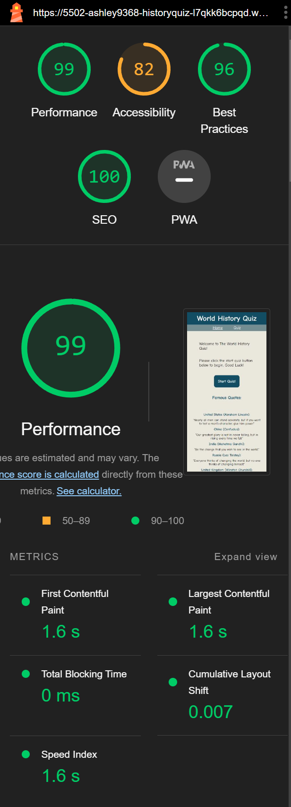
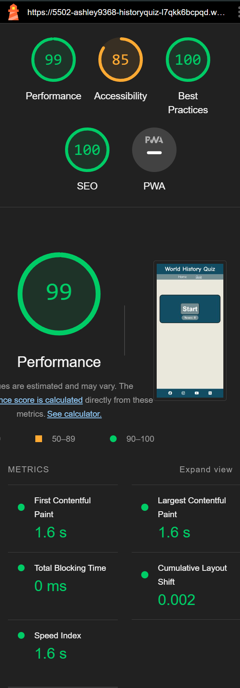
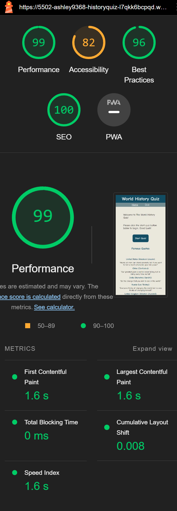
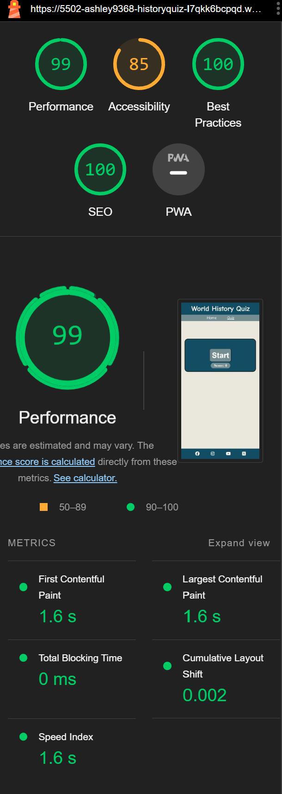

# World History Quiz - Testing

Visit the deployed site: [World History Quiz](https://ashley9368.github.io/History-Quiz/)

- - -

## CONTENTS

* [AUTOMATED TESTING](#automated-testing)
  * [W3C Validator](#w3c-validator)
  * [Lighthouse](#lighthouse)
  * [Full Testing](#full-testing)

Throughout the build i was constantly checking in the dev tools to test new concepts and test out current ones to see what worked well.

I have gone through both pages on my website and checked the responsiveness for various different screen sizes.

## AUTOMATED TESTING

### W3C Validator

[W3C](https://validator.w3.org/#validate_by_input) I used the W3C validator to make sure all my code was correct in the html, And for css i used W3C jigsaw.

* [index.html](assets/images/html-validator-home-page.png) Passed.
* [quiz-page.html](assets/images/html-validator-quiz-page.png) Passed.

* [style.css](assets/images/image-of-css-validator.png) - Passed.

* [JSHint](https://jshint.com/) To test my JavaScript i used JSHint
* [script.js](assets/images/jshint-validator.png) - Passed, 1 warning.

### Lighthouse

I used Lighthouse within the Chrome Developer Tools to test the performance, accessibility, best practices and SEO of the website. 

### Desktop Results 

All pages of the site are achieving a score of 100 across the 4 categories.

### Mobile Results 

- - -

### Full Testing

Full testing was performed on the following devices:

* Desktop:
  * Website default styles were built for 344px width
  * Computer 1920x1080px
  * Computer 1440px
* ipad
  * Surface Duo
  * ipad pro
  * iPad mini
* Mobile Devices:
  * iPhone SE.
  * iPhone 11 pro.
  * iPhone 12 pro.
  * Phone XR.

* I tested the devices on Google Chrome.

`Home Page`

| Feature | Expected Outcome | Testing Performed | Result | Pass/Fail |
| --- | --- | --- | --- | --- |
| Home button in navbar | Keeps user on Home page | Clicked home tab | Stays on Home page | Pass |
| Quiz button in navbar | Takes user to the Quiz page | Clicked Quiz tab | Opens Quiz page | Pass |
| Start Quiz button | takes user to Quiz page | Clicked on button | opens Quiz page | Pass |
| Social medias | takes user to selected socials | Clicked on button | Takes user to socials clicked on | Pass |

`Quiz page`

| Feature | Expected Outcome | Testing Performed | Result | Pass/Fail |
| --- | --- | --- | --- | --- |
| Home button in navbar | Takes the user back to the home page | Clicked title | Home page reloads | Pass |
| Quiz button in navbar | Keeps user on Quiz page | Clicked home tab | Stays on Quiz page | Pass |
| Start quiz function | Initiates Quiz | Clicked start function | Quiz Begins | Pass |
| Answer buttons | Answers Question and if correct shows green if incorrect shows red and moves to next question | Clicked on button colour shows | Continues Quiz until end | Pass |